# 2019
# Bucket And Ball Game - Data Structures Project

  Creating an array in the heap memory area in which bucket objects are kept,
  adding and deleting balls to the bucket, writing the RAM addresses of the balls and buckets,
  reversing the buckets and balls according to the selection, printing and placing the buckets and balls in reverse.

### Used Technologies
  
  - C++
  - Mingw GCC compiler
   
## Screenshots

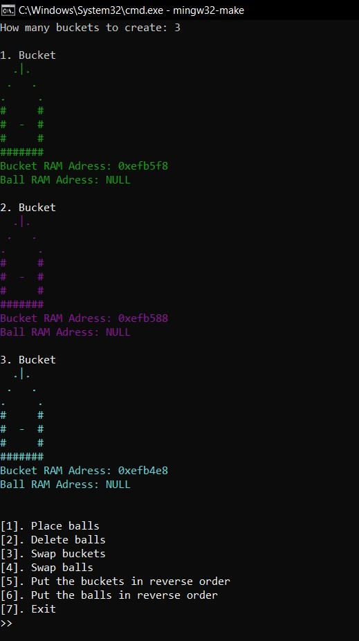
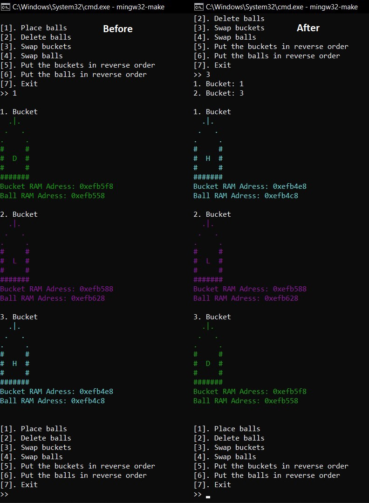
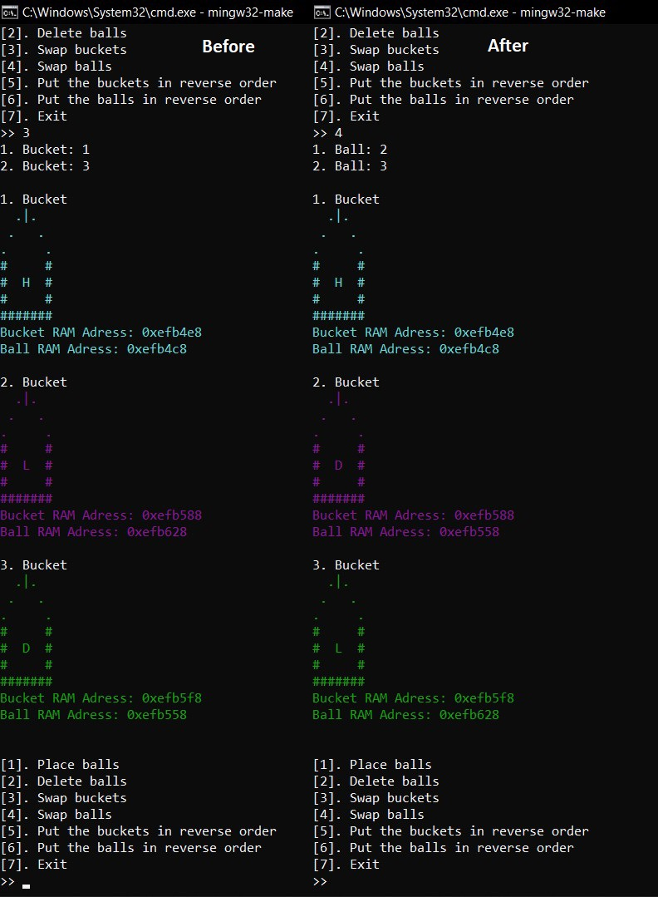
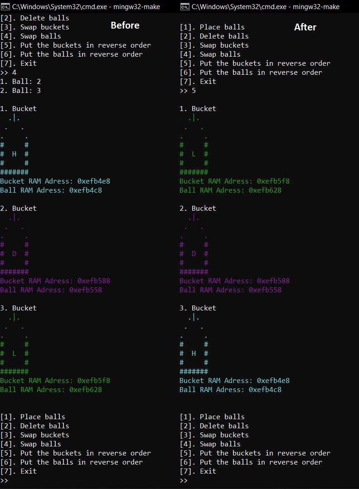
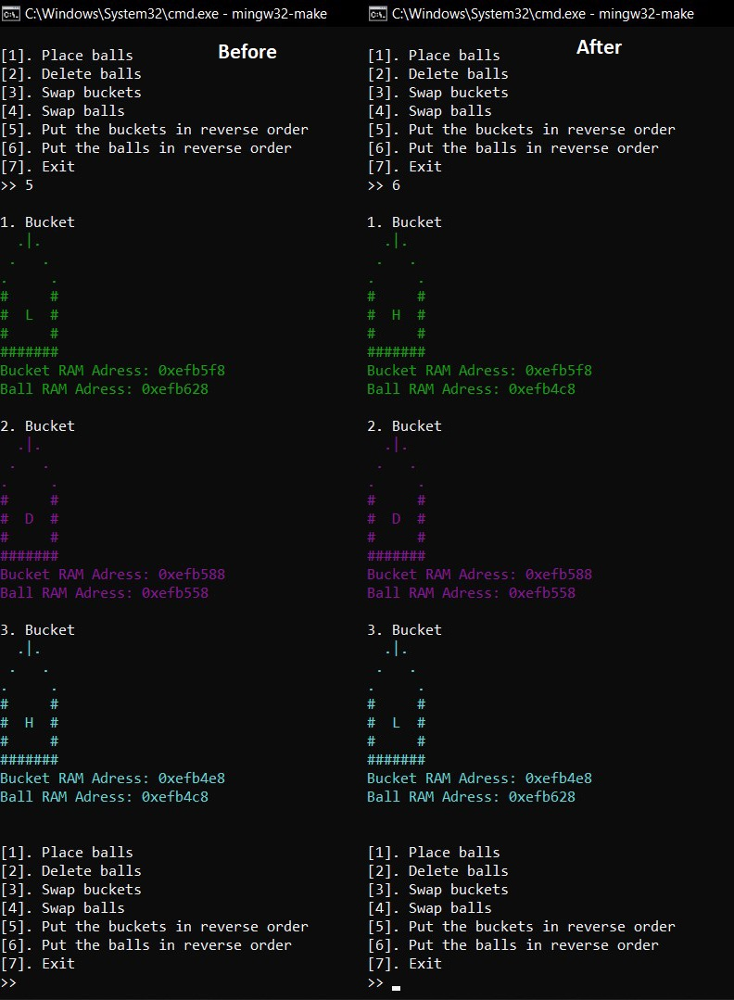
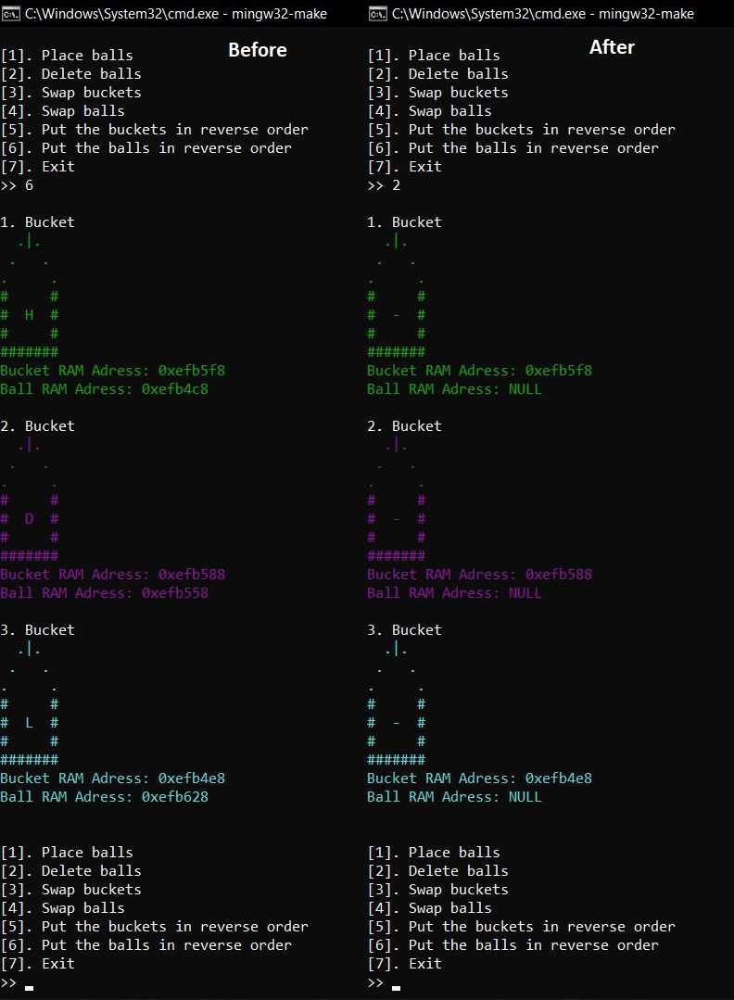

## Homework Document

Sakarya University - Computer Engineering - Data Structures Course Homework

Group members:
  - Berkay Şahin - https://github.com/berkaysahin - https://www.linkedin.com/in/berkaysahin3/ - iletisim@berkaysahin.info
  - Özge Kurt    - https://github.com/ozgeKrt     - https://www.linkedin.com/in/%C3%B6zge-kurt-104a9b1a2/ - ozge.beydam@gmail.com

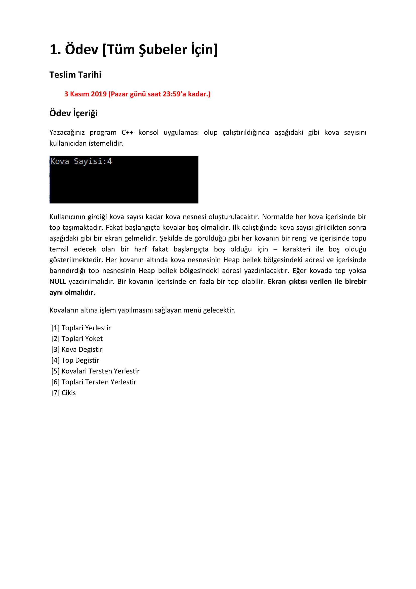
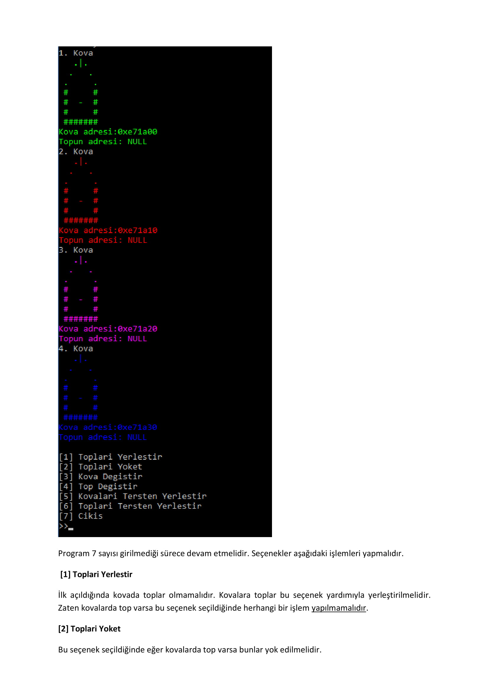
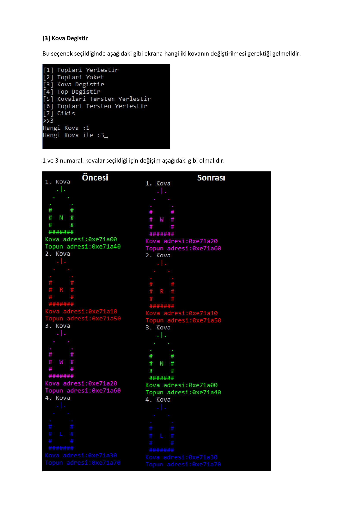
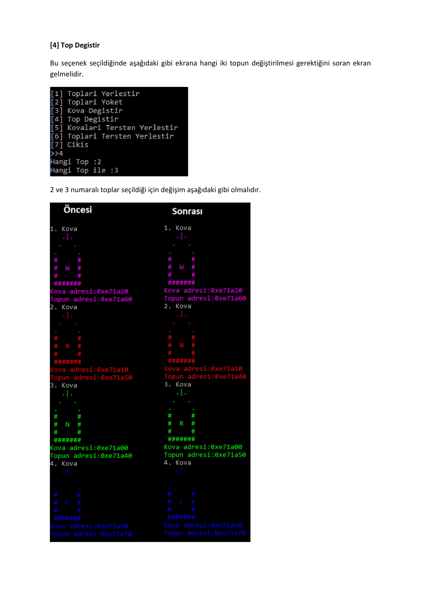
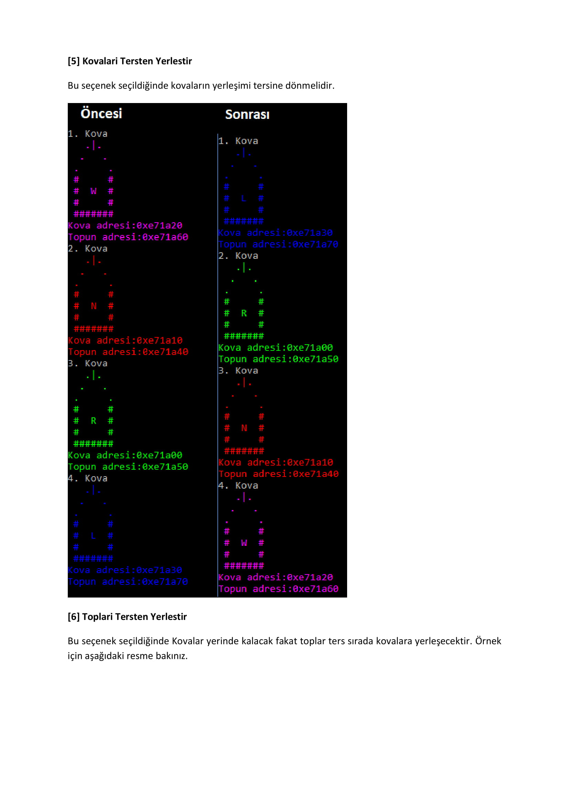
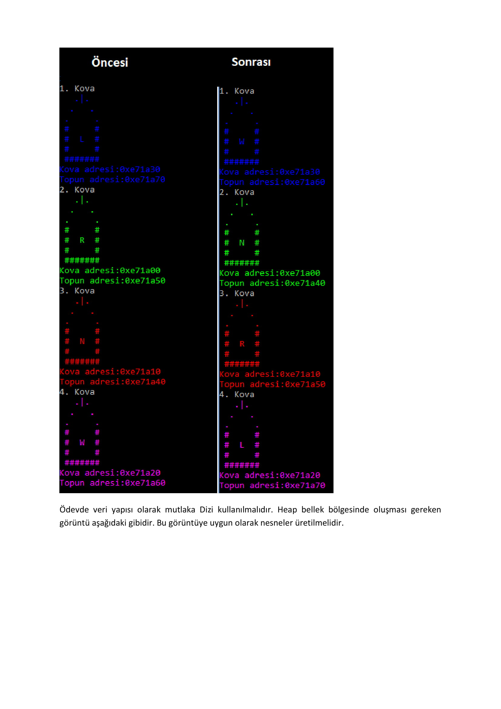
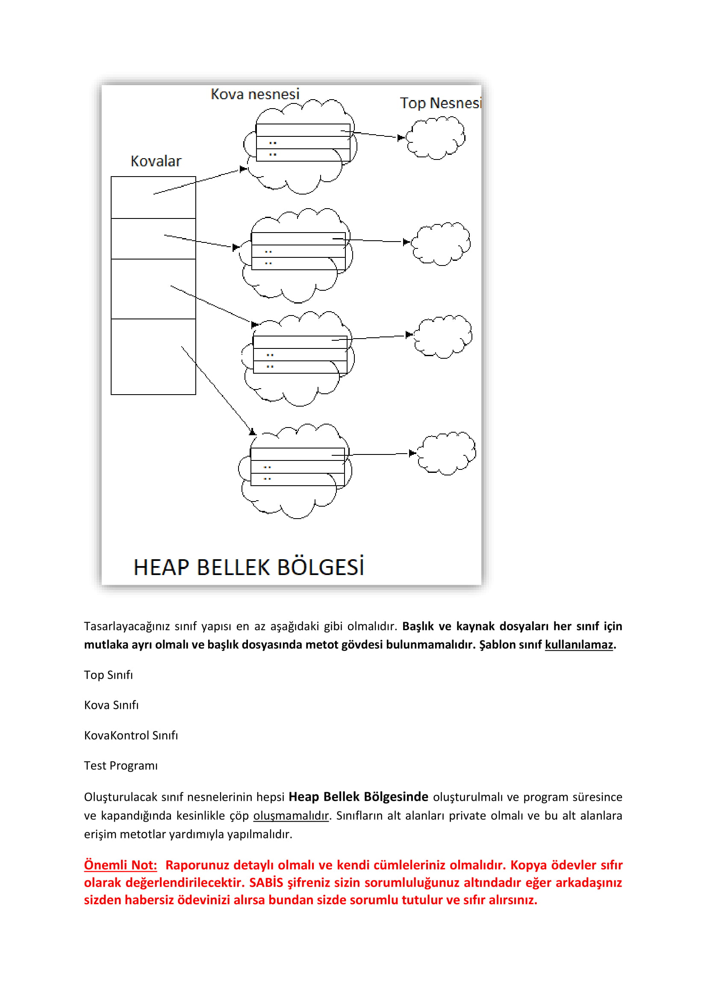
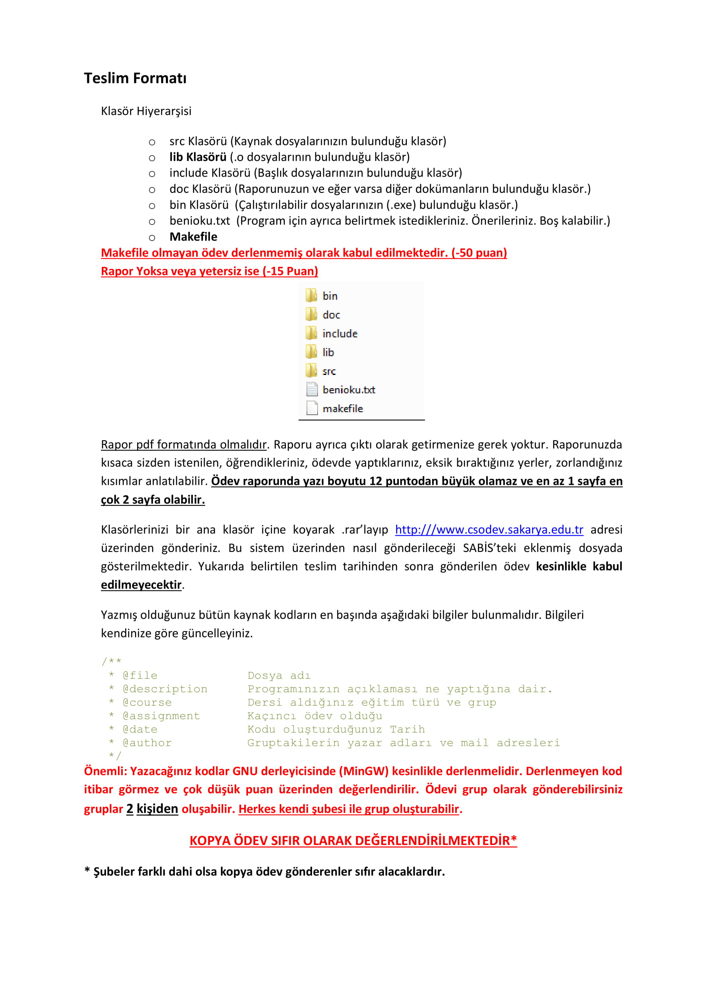
